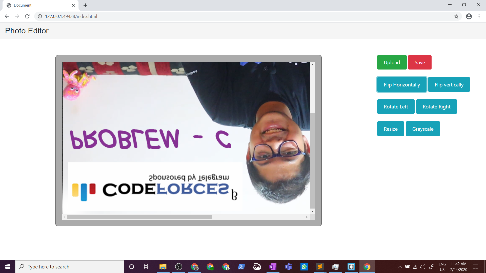
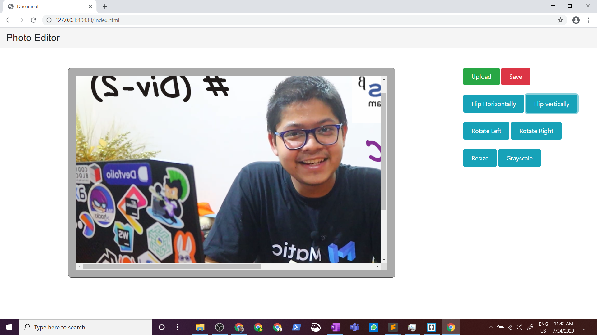
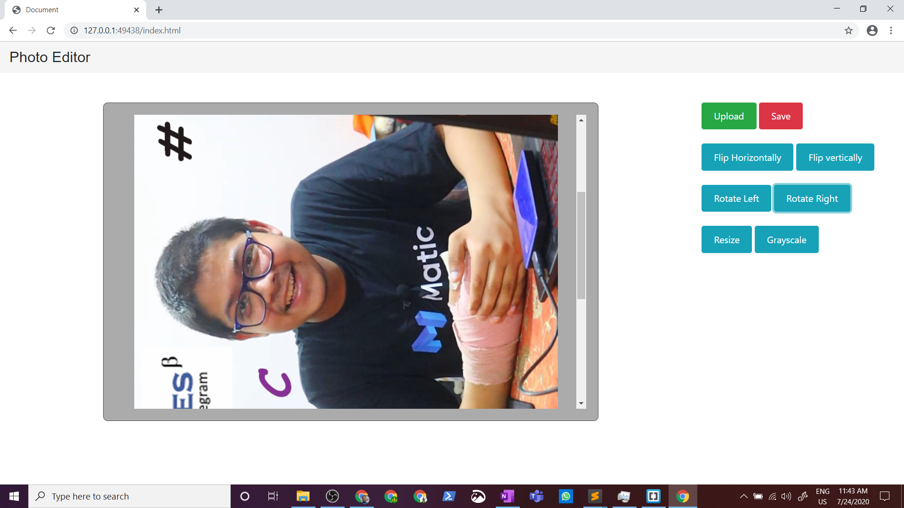
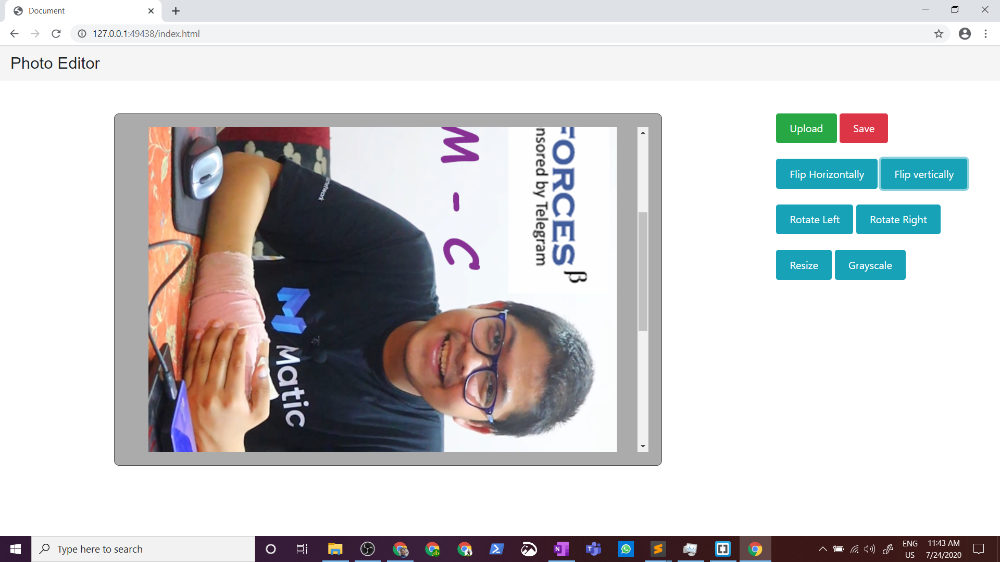
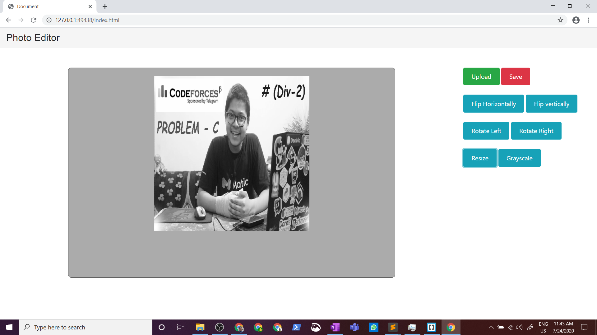

# Photo-Editor
It is a simple Photo editor using the concepts of pixels and 2d and 3d array to perform these operations

# It has features like ->

# 1. Flip Horizontal

# 2. Flip Vertical

# 3. Rotate Left

# 4. Rotate Right

# 5. Resize

# 6. Grayscale

